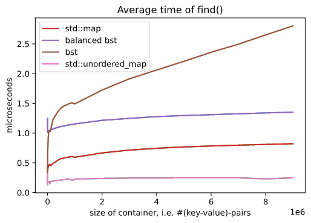
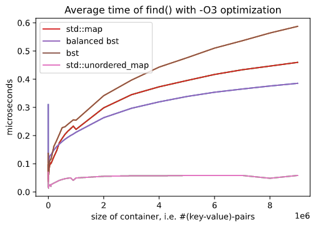

## Introduction

The purpose of this project is the implementation of a templated binary search tree using modern C++14.
The performance of the container has been compared against the one of other built-in containers in the Standard Template Library.
The code has been documented using Doxygen. 


## General Structure


Three classes are implemented:

* `bst<k_t, v_t, OP>`: a templated Binary Search Tree; `k_t` is the key type - `v_t` is the value type - OP, which by default corresponds to std::less<k_t>, an object which implements a templated comparison operation among the keys. The class features two members: `root` (a `std::unique_ptr` pointing to the root node of the tree) and `op`, an OP object.

* `_node<N>`: a struct templated on `N`, the type of the pair stored in the node (in our case std::pair<const k_t, v_t>). The members are and three pointers: `left` and `right` (`std::unique_ptr` to left and right children nodes respectively), and `parent` (raw pointer pointing to the parent node), and the `pair` stored. 

* `_iterator<N, O>`: a templated class whose only private member is `current`, a raw pointer to the current node of type `N`. The second template argument `O` is the type of the pair stored in the node, in order to define both `iterator` and `const_iterator`. 

Since the default visibility of a struct is public, all the members and methods of `_node<N>` are public for the bst class to use. The struct is kept outside the class bst as it does not need to be templated on the comparison operator.
The class `_iterator` provides a way to sequentially access the elements of our container, without exposing its underlying representation. In particular it implements a forward iterator. Bbeing templated on different types, it is implemented outside the bst class. 

## Constructors & Member Functions


The `_node<N>` struct relies on a default decontructor and three constructors: the first and the second take a const lvalue reference and a rvalue reference to N, constructing the new node with the pair given and set parent, left and right to `nullptr`. The third one takes as input a unique pointer to the node to be copied and a raw pointer to set the parent of the node to be constructed, copies the pair and recursively calls itself on the children of the node, if present in the node to be copied. This constructor is then called by the copy constructor of the bst class in order to perform a deep copy. 

The `_iterator<N, O>` class relies on a constructor which initializes the raw pointer to the current node with the given one and a default deconstructor. Furthermore it has:
* `dereference operator*()` which returns a reference to the pair stored in the current node.
* `reference operator->()` which returns the pointer to the pair stored in the current node. 
*  function `getcurrent()` which returns  a  raw pointer to the current node, making it possible to access this private member.
* `pre-increment &operator++()`  and `post-increment operator++(int)` which allows to traverse the tree in-order.
* boolean `operator==` and `operator!=` for comparisons.

The `bst<k_t, v_t, OP>` class has default constructors and deconstructors, default move semantic and custom copy semantic in order to perform a deep copy of a bst object.

Broadly speaking it has:
* Functions implemented in the **public** part.
* Utility functions of the latter, implemented in the **private** part  since do not need to be accessible from outside. 
* **Operators**.


The following are used to travers the tree in-order: the functions `begin()`, `end()`, which are overloaded and return an iterator or a const_iterator to the leftmost and one-past the last node respectively, and  `cbegin()` and `cend()` which are the same but return always a const_iterator. 


#### my_find
```
//private
std::pair<node *, const bool> my_find(const k_t& x) const;

```
my_find is an utility private function whose main goal is to ease the the work done by `find` and `insert`. It returns a pair of an pointer to node and a boolean: if the key specified as input is present in the tree, then the pointer to the found node is returned and the boolean variable is set to true; instead, if the key is not found, then a pointer to the parent node is returned together with a false statement.


#### insert
```
//private
template <typename O> 
std::pair<iterator,bool>  _insert(O&&x);

//public
std::pair<iterator, bool> insert(const pair_type& x){ return _insert(x);}
std::pair<iterator, bool> insert(pair_type&& x){ return _insert(std::move(x));} 

```
`insert` allows the user to insert a new node in the tree, by giving a const lvalue or a rvalue reference to the pair as input. In order to make the code more clear, both the versions for `insert` invoked `_insert`, a private function in which `forward<O>` is called to allow for the usage of lvalue or rvalue reference according to the needs of the function. `insert` exploits `my_find` to look for the key and insert it, whether it is not already in the tree: in this case it returns a pair of an iterator to the node and a bool evaluated to true. In the case in which the key was already present, then an iterator to the node of the retrieved key is returned together with a the boolean value set to false.

#### find
```
//public
iterator find(const k_t& x);
const_iterator find(const k_t& x) const;

```
`find` searches for the key in the tree and two versions of this function are implemented, returning an iterator (or const_iterator) to the proper node if the key is already present; end() iterator (or const_iterator) otherwise.


#### emplace
```
//public
template< class... Types >
std::pair<iterator,bool> emplace(Types&&... args)
  
```

`emplace` calls `_insert` by giving in input a `forward<O>` construct, which allows flexibility in  taking const lvalue or rvalue references as inputs. Therefore it behaves like `insert` itself: the only difference is that it uses a variadic template, requesting in input two args (key and value). It returns a pair of an iterator to the added node if the key was not present before, together with a true statement; instead, if the key was already present, then an iterator to the already present node is returned, and the boolean value is false.


#### exchange
```
//private
void exchange(node* N1, node* N2)

```

The function is used to support the erase function, basically it takes two raw ptr to node which have to be exchanged, the most simple way to do this that came to us has been to create a new node with the samep pair of N2 (the node to be copied) and then exchanging it with N1, exchanging parent and left and right node. The usage of smart pointers allow us to be sure that everything will be done with no memory leaks.

#### _erase
```
//private
void _erase(node* x);

//public
void erase(const k_t& x);

```
`_erase` is the heart of the erasing of a node, the function is recursive and take as input a ptr to the node to be erased, the case zero is the one in which the node to be erased has no child, in this case, we simply delete it by the resetting of the left/right ptr of his parent. The other cases are the ones in which the node to be deleted has only left child, only right child, or both child: in the first case we exchange the node to be erased with the node which has the biggest key smaller than the one to be erased, in the two other cases we exchange with the smallest key which is bigger than the one to be erased. The last control is if the height of the tree of the node to be erased is 1 one (so we are deleting the last node of the tree), where we simly reset the root, deleting the tree. Then `erase` delete the node which has as key the one passed in input, it call the function `my_find` to find the ptr to that node, and if that key is present in the tree it pass the ptr to the `_erase` function.


#### clear
```
//public
void clear();
```

Clears the content of the tree by calling the `.reset()` function on the unique pointer `root`.


#### balance
```
//private
void _balance(std::vector<pair_type>& v, int begin, int end);
 
//public
void balance();
```

A function which balances the tree. After a call to this void function, the absolute difference of heights of left and right subtrees at any node is less than one. It fills an `std::vector<pair_type>` with the pairs stored in the node of the tree, traversing it in-order by means of a range-for-loop. Then calls the function clear() to clear the content of the tree and the utility function _balance. This private function takes as arguments an `std::vector<pair_type>` and two integer indexes to the first and last element of the vector. It inserts a node, in the cleared tree, with the key given by the one in the middle of the vector (or one past the medium one if even) and recursively calls itself on the two subvectors. 

In addition to this we implemented as well a function `is_balanced()`  to check if the bst is balanced and one to compute the height of it `height()`.
Both uses two utility private functions with the same names that takes as input a pointer to the root of a tree and are recursively called to the left and right subtrees. 

#### Subscripting operator []
```
//public
v_t& operator[](k_t&& x);
v_t& operator[](const k_t& x);

```

the `subscripting operator []` is an overloading operator which, given a key in input (in form of rvalue reference or const lvalue), returns a reference to the associated value if the key was already present in the tree; otherwise, the key is inserted and the associated value is a default one (obtained writing v_t v ={}). 

#### Put-to operator <<
```
//public
friend
std::ostream& operator<<(std::ostream& os, const bst& x);
```
A friend function which prints the tree. It takes in input a const lvalue reference to the tree and a reference to a stream object. The tree is traversed in-order by means of a range-based for loop.


## Benchmark
We have tested the performance of our Binary Search Tree implementation against the one of the `std::map` and `std::unordered_map` containers. Those indeed are associative containers, respectively sorted and not, which store key-value pairs with unique keys. In particular we have compared the `find()` member function among those, considering both with and without balancing the `bst` object.

We have considered different numbers of `N`  key-value pairs to be stored, i.e. $`{1,...,9}x{10^2,10^3,...,10^6}`$ and inserted pairs with pseudo randomly generated integer keys between 1 and `N`. Being irrelevant for the scope, the values equal the keys types and values. For each value of `N` and each container `B` we have performed a search for all the keys present and took the mean in order to measure the average time for the search. The function return an iterator to the element equivalent to key and this have been used to perform a simple operation (every time a counter is incremented and at the end it is printed) in order to prevent an implicit optimization by the compiler and be sure that the call to find() have been actually performed. The order of the keys to be searched follows an additional randomizations, otherwise using the same order of insertion would have result in compromised timings.

All the measurements have been taken three times in microseconds using `std::chrono` and then the results have been averaged among the three runs. We have evaluated the number of runs to be enough since the results obtained show low variance.

The code `test.cpp` used together with all the results in csv format are stored in the `benchmark` directory, here we present a plot.
As expected the average time of a search in a Binary Search Tree is significantly improved by balancing the tree. The results are more similar to those of the map, which indeed is usually implemented as a Red-and-black tree, which among other properties is a balanced Binary Search Tree and performs the search with logarithmic-time complexity. 
The unordered_map outperformes the others, since it does not rely on an internal order of the keys but on the hash of those and performs the search with constant-time complexity.





Then we have copiled the codes with -O3 optimizations and rerun the same benchmark, obtaining the results shown in the following picture. The overall timings are significantly smaller with respect to the previus ones and this time the balanced bst performed the search faster than the std::map. We can then conclude that our implementation makes it somehow easier for the compiler to optimize the find function and results in better timings. 





The compiler used is the version 9.3.0 of g++. 


